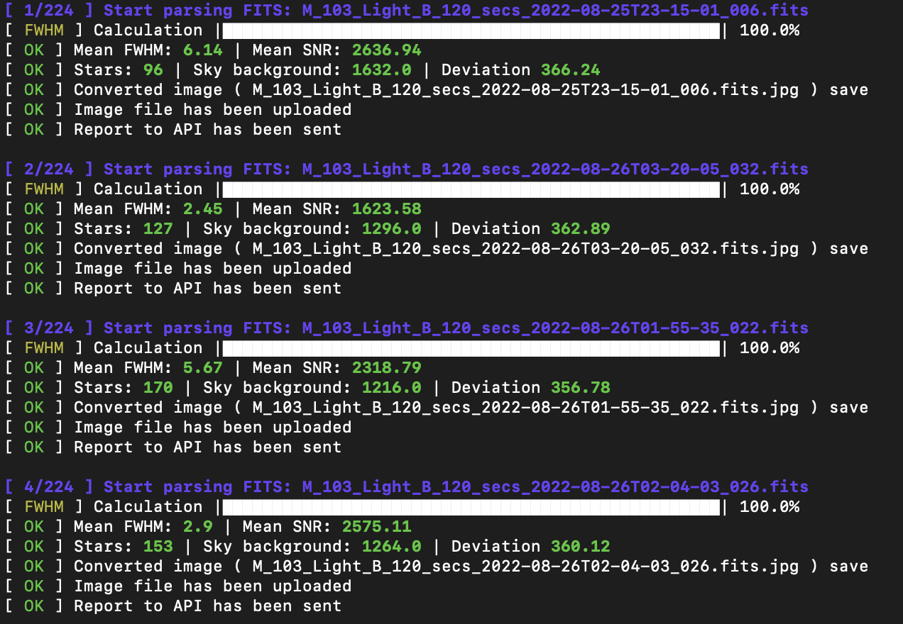

# Astronomical Image Analyzer 

This script is designed to analyze astronomical data files (**FITS**). 
The algorithms used were written by several authors, this script combines all the tools into one and provides the following features:
- Calculation of the background of the starry sky and search for stars in the image.
- Computing the FHWM for each star in the image and finding the average.
- Calculation of the signal-to-noise parameter for each star and the average value of the entire field.
- Creation of report files (txt and csv) for each FITS file.
- Plotting Calculated Values.
- Convert FITS to JPEG image file and send to remote server.
- Sending FITS file headers and forced values (number of stars, FWHM, SNR, etc.) to a remote server.

This script is used to analyze captured frames of astronomical images from a homemade astronomical observatory. 
File analysis data are uploaded to a remote server, where they are visualized in order to accumulate and store information about the astronomical objects being photographed. 
Using the calculated parameters (FWHM, etc.), you can evaluate the quality of captured frames, and image preview allows you to evaluate frames immediately after uploading to the server.

An example of uploaded data can be viewed here: 
https://observatory.miksoft.pro/object/IC_1396

The repository for this service is here: https://github.com/miksrv/observatory

## Installing and running the script 
The script is written in Python (v 3.10), to run it, you need to have a language interpreter installed on your computer. 
On an OS such as Linux, it comes by default, and for Windows, you need to download and install from the official site: 
https://www.python.org/downloads/windows/

1. Go to the directory with the downloaded script, open console and install necessary additional packages. 
Type in the command line:
`pip install numpy configparser matplotlib astropy scipy`
2. Set up a configuration file. Set the following values in the **config.ini** file:
- Path to the root directory with FITS files. The script works recursively and checks all nested directories:
`path = /home/user/fits`
- If the FWHM calculation option is enabled `calculateFWHM = on`, then you need to specify the path to the bias calibration file: 
`calibrateBiasFile = /home/user/calibrate/bias.fits`
- If a remote service is configured to receive data about analyzed files `toAPI = on`, then you need to specify the API:
`toAPIEndpoint = http://api.miksoft.pro/astro/set/fits`
- If you want to upload image files that will be converted from FITS `upload = on`, then you must also specify the API:
`uploadAPI = http://api.miksoft.pro/astro/set/image`
3. The minimum configuration is done, you need to run the script through the console (command line):
` py.exe .\main.py`